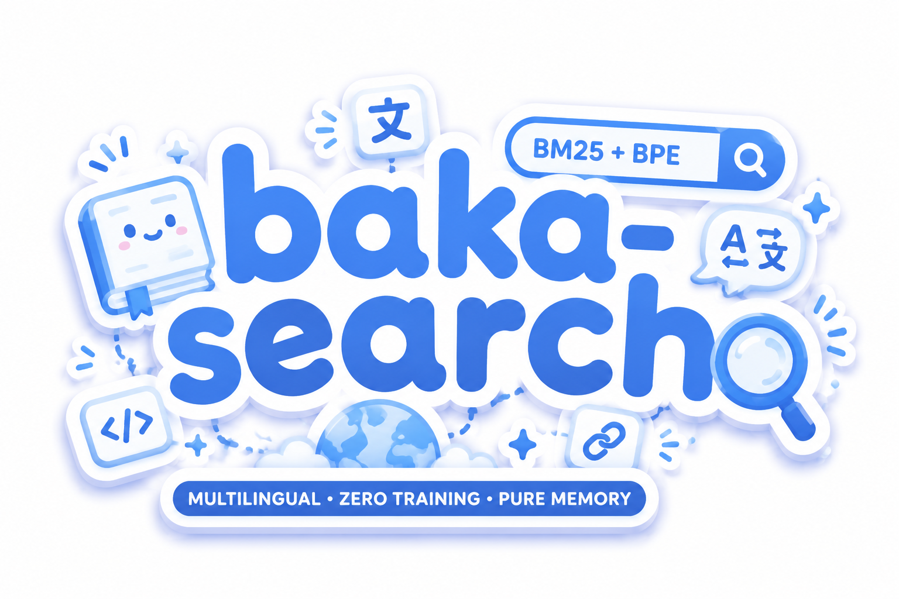

# baka-search



## 背景

某天中午吃完饭后我寻思: 朴素 BM25 用空格分词, 天然不支持多语言. 那如果用 LLM 的分词器来代替呢?

再进一步, 把嵌入层余弦相似的 `token` 也加入搜索, 就能实现近义词甚至跨语言检索. 跨语言的相似 `token` 还可以用来过滤反义词:

- `true` 和 `false` 余弦相似度约 0.5 (经常在 "X or Y" 结构中成对出现)
- `真` 和 `true` 也相似 (跨语言同义)
- 但 `真` 和 `false` 大概率不相似 (中文语料中很少跟 false 直接共现)

所以跨语言桥可以一定程度挡住反义词

## 简介

**BM25 + BPE** 全文搜索库。**纯内存**，**零外部依赖**，**即开即用**。

使用 **Gemma4 BPE** 分词器代替标准空格分词，解决多语言搜索问题。

## 用法

```typescript
import { BakaSearch } from "baka-search";

const search = new BakaSearch({ fields: ["title", "content"] });

search.add({ id: 1, title: "hello world", content: "..." });
search.add({ id: 2, title: "你好世界", content: "..." });

const results = search.search("hello");
```

可选桥接扩展（跨语言同义词扩展）：

```typescript
const results = await search.searchWithBridge("hello");
```

> **不推荐在生产中使用桥扩展.** 由基准测试可知, 桥扩展大部分时候引入的是噪声. 语义近似不一定是同义词 -- `🐱` 和 `🐶` 也是相似 token (都是宠物), 但它们既不是反义词也不是近义词

## 基准测试

| 数据集                                   | BM25   | 桥扩展 | 差距        |
| ---------------------------------------- | ------ | ------ | ----------- |
| [MIRACL](./docs/benchmark/miracl.md)     | 0.4806 | 0.4403 | -0.0403     |
| [Belebele](./docs/benchmark/belebele.md) | 0.4811 | 0.4705 | -0.0105     |
| [MLQA](./docs/benchmark/mlqa.md)         | 0.1664 | 0.1807 | **+0.0143** |

基于 mteb 排行榜（102 / 89 / 77 个模型对比），nDCG@10 指标。

需要注意的是，排行榜上的其他模型都是需要大规模训练的向量嵌入模型（如 BGE、Qwen Embedding、Cohere 等），而 baka-search 是**零训练、纯关键词匹配**的 BM25 搜索库。能在无监督、无训练的情况下排在各自前 60%，纯 BM25 在跨语言 MLQA 甚至超过了一些有监督的向量模型，这证明了 BPE 分词 + BM25 在多语言场景下的竞争力。

## 致谢

- [Gemma4](https://www.kaggle.com/models/google/gemma-4) BPE 分词器及其 262k 词表
- [HuggingFace Tokenizers](https://github.com/huggingface/tokenizers) 的 Rust BPE 实现参考
- [MiniSearch](https://github.com/lucaong/minisearch) 作为 API 设计的参考

## License

MIT
